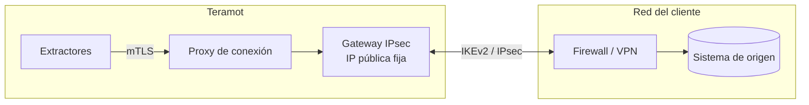

Teramot ofrece tres formas de llegar a un sistema de origen. La elección depende de dónde esté el sistema y de las políticas de red del cliente.

| Método | Cuándo usarlo |
|---|---|
| **Red privada IPsec** (recomendado) | El sistema está en un centro de datos o en una red privada. Es la opción más segura: el tráfico viaja por una VPN sitio a sitio dedicada y el sistema no necesita exponerse a Internet. |
| **Túnel SSH** | El sistema está en una red privada que tiene un servidor bastión accesible por SSH. |
| **Acceso por Internet con lista blanca de IP** | El sistema ya es accesible desde Internet, por ejemplo un servicio en la nube, un SaaS o un warehouse. |

En todos los casos, Teramot **inicia** la conexión hacia el origen y solo lee datos.

## Red privada IPsec

Teramot opera un **gateway IPsec** propio que establece una VPN sitio a sitio con el firewall o el concentrador VPN del cliente. Es la forma recomendada de conectar sistemas que viven en una red privada.

### Cómo funciona

- Cada conexión de cliente corre **aislada** en su propio espacio de red dentro del gateway. El tráfico de un cliente no puede cruzarse con el de otro, aunque los dos usen los mismos rangos de IP.
- Los extractores no ven las direcciones internas del cliente. Llegan al origen a través de un proxy autenticado con TLS mutuo, usando una referencia opaca a la conexión.
- Para su lado del túnel, Teramot asigna un bloque `/29` del rango `100.64.0.0/10` (RFC 6598), que no choca con las redes privadas habituales.
- Si hace falta, se puede configurar la **resolución DNS interna** del cliente en cada conexión.

### Qué entrega cada parte

| El cliente entrega | Teramot entrega |
|---|---|
| IP pública del equipo VPN (IPv4) | IP pública fija del gateway |
| Redes internas a las que hay que llegar | Bloque `/29` del lado de Teramot |
| Identificadores IKE | Clave precompartida generada por Teramot, que se muestra una sola vez |
| Perfil criptográfico elegido | Parámetros del túnel |
| Servidores DNS internos (opcional) | |

### Parámetros criptográficos

| | Perfil moderno | Perfil compatible |
|---|---|---|
| Protocolo | IKEv2 | IKEv2 |
| Cifrado | AES-256-GCM | AES-256 |
| Integridad / PRF | SHA-256 | SHA-256 |
| Grupo Diffie-Hellman | ECP-256 | MODP-2048 |
| Perfect Forward Secrecy | Obligatorio | Obligatorio |
| Vida de IKE SA / Child SA | 8 h / 1 h | 8 h / 1 h |
| Autenticación | Clave precompartida | Clave precompartida |

No se aceptan IKEv1, 3DES, DES, SHA-1, MD5 ni MODP-1024. El gateway solo acepta tráfico IKE (UDP 500 y 4500) desde las IP públicas que declaró cada cliente.

### Habilitación

Las conexiones privadas se habilitan por workspace. Una vez habilitadas, un administrador las crea y gestiona desde la aplicación.

## Túnel SSH

1. Teramot genera un **par de claves RSA de 4096 bits por workspace**.
2. El cliente instala la clave pública en su servidor bastión, en un usuario dedicado.
3. Teramot abre un túnel SSH hasta el bastión y, desde ahí, se conecta al sistema de origen en la red interna.

La clave privada nunca sale de Teramot.

## Acceso por Internet con lista blanca de IP

Las conexiones hacia las fuentes salen de Teramot desde estas **direcciones IP de salida fijas**. La aplicación muestra la misma lista al configurar la fuente. El cliente puede restringir el acceso a su sistema solo a esas IP.

| IP de salida |
|---|
| `52.3.133.170` |
| `54.205.21.141` |

Las conexiones a bases de datos usan cifrado TLS cuando el motor lo ofrece.

## Requisitos de red

El firewall del cliente debe permitir el tráfico entrante desde las IP de Teramot hacia el puerto del sistema de origen. Estos son los puertos por defecto, que se pueden cambiar al configurar la fuente:

| Sistema | Puerto por defecto (TCP) |
|---|---|
| PostgreSQL | 5432 |
| Amazon Redshift | 5439 |
| MySQL, MariaDB | 3306 |
| SQL Server, Azure SQL Database | 1433 |
| Oracle | 1521 |
| SAP HANA | 30015 |
| Teradata | 1025 |
| MongoDB | 27017 |
| SAP ECC (RFC) | 3300 + número de sistema |
| Bastión SSH | 22 |
| Gateway IPsec | UDP 500 y 4500, desde y hacia `32.192.124.113` |

Databricks, Snowflake, BigQuery y las aplicaciones SaaS se alcanzan por HTTPS (TCP 443) en los endpoints públicos de cada proveedor.

Para preparar el usuario y los permisos en cada sistema, ver [Preparar las fuentes](/es/architecture/source-setup/).

## Aplicaciones SaaS

Las aplicaciones SaaS se conectan por sus APIs públicas, con OAuth o con tokens de acceso. No requieren configuración de red.
