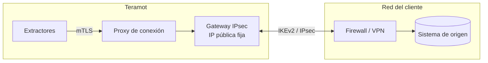

Teramot ofrece cuatro formas de llegar a una base de datos. La elección depende de dónde esté el sistema y de las políticas de red del cliente.

| Método | Cuándo usarlo | Motores |
|---|---|---|
| **Conexión privada (IPsec)** (recomendada para redes privadas) | El sistema está en un centro de datos o en una red privada. El tráfico viaja por una VPN sitio a sitio dedicada y el sistema no necesita estar expuesto a Internet. | PostgreSQL, MySQL, SQL Server, Oracle DB, MongoDB |
| **Túnel SSH** | El sistema está en una red privada que tiene un servidor bastión accesible por SSH. | PostgreSQL, MySQL, SQL Server, Oracle DB |
| **Lista blanca de IP** | El sistema está detrás de un firewall que puede admitir las IP de salida de Teramot. | Todas las bases de datos |
| **Conexión directa** | El sistema ya es accesible desde Internet, como un warehouse en la nube. | Todas las bases de datos |

En todos los casos, Teramot **inicia** la conexión hacia el origen y solo lee datos. Qué métodos ofrece cada motor, y cómo configurar cada uno, está en [Connect your data](/product/connect-data/overview/#how-teramot-reaches-a-database) (en inglés).

## Red privada IPsec

Teramot opera un **gateway IPsec** propio que establece una VPN sitio a sitio con el firewall o el concentrador VPN del cliente. Es la forma recomendada de conectar sistemas que viven en una red privada.

### Cómo funciona

- Cada conexión de cliente corre **aislada** en su propio espacio de red dentro del gateway. El tráfico de un cliente no puede cruzarse con el de otro, aunque los dos usen los mismos rangos de IP.
- Los extractores no ven las direcciones internas del cliente. Llegan al origen a través de un proxy autenticado con TLS mutuo, usando una referencia opaca a la conexión.
- Para su lado del túnel, Teramot asigna un bloque `/29` del rango `100.64.0.0/10` (RFC 6598), que no choca con las redes privadas habituales.
- Si hace falta, se puede configurar la **resolución DNS interna** del cliente en cada conexión.

### Parámetros del túnel

El túnel es IKEv2 con una clave precompartida que Teramot genera y muestra una sola vez, y Perfect Forward Secrecy es obligatorio. Hay un perfil moderno (AES-256-GCM, ECP-256) y uno compatible (AES-256, MODP-2048), ambos con SHA-256. No se aceptan IKEv1, 3DES, DES, SHA-1, MD5 ni MODP-1024, y el gateway solo acepta tráfico IKE (UDP 500 y 4500) desde las IP públicas que declaró cada cliente.

Las conexiones privadas se habilitan por workspace, y un admin las crea desde la aplicación. Las propuestas exactas, los tiempos de vida y los pasos del lado del cliente están en [Private connections](/product/connect-data/private-connections/) (en inglés).

## Túnel SSH

1. Teramot genera un **par de claves RSA de 4096 bits por workspace**.
2. El cliente instala la clave pública en su servidor bastión, en un usuario dedicado.
3. Teramot abre un túnel SSH hasta el bastión y, desde ahí, se conecta al sistema de origen en la red interna.

La clave privada nunca sale de Teramot.

## Acceso por Internet con lista blanca de IP

Las conexiones hacia las fuentes salen de Teramot desde estas **direcciones IP de salida fijas**. La aplicación muestra la misma lista al configurar la fuente. El cliente puede restringir el acceso a su sistema solo a esas IP.

| IP de salida |
|---|
| `52.3.133.170` |
| `54.205.21.141` |

Las conexiones a bases de datos usan cifrado TLS cuando el motor lo ofrece.

## Requisitos de red

El firewall del cliente debe permitir el tráfico entrante desde las IP de salida de Teramot hacia el puerto del sistema de origen. El puerto por defecto de cada motor está en [Databases and warehouses](/product/connect-data/databases/), y los de MongoDB y SAP ECC en [Applications and cloud sources](/product/connect-data/apps-and-cloud/) (en inglés). Además:

- Un bastión SSH necesita el TCP 22 (o el puerto configurado) abierto a las IP de Teramot.
- Una conexión privada necesita UDP 500 y 4500 hacia y desde el gateway IPsec, `32.192.124.113`.
- Databricks, Snowflake, BigQuery y las aplicaciones SaaS se alcanzan por HTTPS (TCP 443) en los endpoints públicos del proveedor.

Para preparar el usuario y los permisos en cada sistema, ver [Prepare your sources](/product/connect-data/prepare-sources/) (en inglés).

## Aplicaciones SaaS

Las aplicaciones SaaS se conectan a través de sus API públicas, con las credenciales que pide cada una (ver [Applications and cloud sources](/product/connect-data/apps-and-cloud/), en inglés). No requieren configuración de red.
