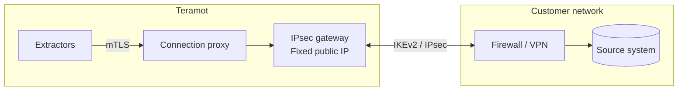

Teramot offers three ways to reach a source system. The choice depends on where the system is and on your organization's network policies.

| Method | When to use it |
|---|---|
| **IPsec private network** (recommended) | The system is in a data center or on a private network. It is the most secure option: traffic travels over a dedicated site-to-site VPN and the system does not need to be exposed to the Internet. |
| **SSH tunnel** | The system is on a private network that has a bastion server reachable over SSH. |
| **Internet access with an IP allowlist** | The system is already reachable from the Internet, for example a cloud service, a SaaS, or a warehouse. |

In all cases, Teramot **initiates** the connection to the source and only reads data.

## IPsec private network

Teramot operates its own **IPsec gateway** that establishes a site-to-site VPN with your firewall or VPN concentrator. It is the recommended way to connect systems that live on a private network.

### How it works

- Each customer connection runs **isolated** in its own network space within the gateway. One customer's traffic cannot cross with another's, even if both use the same IP ranges.
- Extractors do not see your internal addresses. They reach the source through a proxy authenticated with mutual TLS, using an opaque reference to the connection.
- For its side of the tunnel, Teramot assigns a `/29` block from the `100.64.0.0/10` range (RFC 6598), which does not collide with common private networks.
- If needed, your **internal DNS resolution** can be configured on each connection.

### What each party provides

| You provide | Teramot provides |
|---|---|
| Public IP of the VPN device (IPv4) | Fixed public IP of the gateway |
| Internal networks that must be reachable | `/29` block on Teramot's side |
| IKE identifiers | Pre-shared key generated by Teramot, shown only once |
| Chosen cryptographic profile | Tunnel parameters |
| Internal DNS servers (optional) | |

### Cryptographic parameters

| | Modern profile | Compatible profile |
|---|---|---|
| Protocol | IKEv2 | IKEv2 |
| Encryption | AES-256-GCM | AES-256 |
| Integrity / PRF | SHA-256 | SHA-256 |
| Diffie-Hellman group | ECP-256 | MODP-2048 |
| Perfect Forward Secrecy | Required | Required |
| IKE SA / Child SA lifetime | 8 h / 1 h | 8 h / 1 h |
| Authentication | Pre-shared key | Pre-shared key |

IKEv1, 3DES, DES, SHA-1, MD5, and MODP-1024 are not accepted. The gateway only accepts IKE traffic (UDP 500 and 4500) from the public IPs that each customer declared.

### Enablement

Private connections are enabled per workspace. Once enabled, an admin creates and manages them from the application.

## SSH tunnel

1. Teramot generates a **4096-bit RSA key pair per workspace**.
2. You install the public key on your bastion server, under a dedicated user.
3. Teramot opens an SSH tunnel to the bastion and, from there, connects to the source system on the internal network.

The private key never leaves Teramot.

## Internet access with an IP allowlist

Connections to your sources leave Teramot from these **fixed egress IP addresses**. The application shows the same list when you configure the source. You can restrict access to your system to these IPs only.

| Egress IPs |
|---|
| `52.3.133.170` |
| `54.205.21.141` |

Database connections use TLS encryption when the engine supports it.

## Network requirements

Your firewall must allow inbound traffic from the Teramot IPs to the port of the source system. These are the default ports, which you can change when configuring the source:

| System | Default port (TCP) |
|---|---|
| PostgreSQL | 5432 |
| Amazon Redshift | 5439 |
| MySQL, MariaDB | 3306 |
| SQL Server, Azure SQL Database | 1433 |
| Oracle | 1521 |
| SAP HANA | 30015 |
| Teradata | 1025 |
| MongoDB | 27017 |
| SAP ECC (RFC) | 3300 + system number |
| SSH bastion | 22 |
| IPsec gateway | UDP 500 and 4500, to and from `32.192.124.113` |

Databricks, Snowflake, BigQuery, and SaaS applications are reached over HTTPS (TCP 443) on the provider's public endpoints.

To prepare the user and permissions on each system, see [Preparing your sources](/architecture/source-setup/).

## SaaS applications

SaaS applications connect through their public APIs, with OAuth or access tokens. They require no network configuration.
