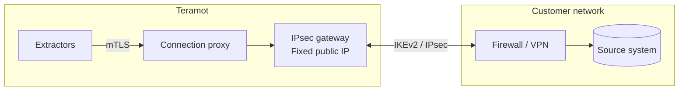

Teramot offers four ways to reach a database. The choice depends on where the system is and on your organization's network policies.

| Method | When to use it | Engines |
|---|---|---|
| **Private connection (IPsec)** (recommended for private networks) | The system is in a data center or on a private network. Traffic travels over a dedicated site-to-site VPN and the system does not need to be exposed to the Internet. | PostgreSQL, MySQL, SQL Server, Oracle DB, MongoDB |
| **SSH tunnel** | The system is on a private network that has a bastion server reachable over SSH. | PostgreSQL, MySQL, SQL Server, Oracle DB |
| **IP allowlist** | The system is behind a firewall that can admit Teramot's egress IPs. | Every database |
| **Direct connection** | The system is already reachable from the Internet, such as a cloud warehouse. | Every database |

In all cases, Teramot **initiates** the connection to the source and only reads data. Which methods each engine offers, and how to set each one up, is in [Connect your data](/product/connect-data/overview/#how-teramot-reaches-a-database).

## IPsec private network

Teramot operates its own **IPsec gateway** that establishes a site-to-site VPN with your firewall or VPN concentrator. It is the recommended way to connect systems that live on a private network.

### How it works

- Each customer connection runs **isolated** in its own network space within the gateway. One customer's traffic cannot cross with another's, even if both use the same IP ranges.
- Extractors do not see your internal addresses. They reach the source through a proxy authenticated with mutual TLS, using an opaque reference to the connection.
- For its side of the tunnel, Teramot assigns a `/29` block from the `100.64.0.0/10` range (RFC 6598), which does not collide with common private networks.
- If needed, your **internal DNS resolution** can be configured on each connection.

### Tunnel parameters

The tunnel is IKEv2 with a pre-shared key that Teramot generates and shows only once, and Perfect Forward Secrecy is required. There is a modern profile (AES-256-GCM, ECP-256) and a compatible one (AES-256, MODP-2048), both with SHA-256. IKEv1, 3DES, DES, SHA-1, MD5, and MODP-1024 are not accepted, and the gateway only accepts IKE traffic (UDP 500 and 4500) from the public IPs each customer declared.

Private connections are enabled per workspace, and an admin creates them in the application. The exact proposals, lifetimes and the steps on your side are in [Private connections](/product/connect-data/private-connections/).

## SSH tunnel

1. Teramot generates a **4096-bit RSA key pair per workspace**.
2. You install the public key on your bastion server, under a dedicated user.
3. Teramot opens an SSH tunnel to the bastion and, from there, connects to the source system on the internal network.

The private key never leaves Teramot.

## Internet access with an IP allowlist

Connections to your sources leave Teramot from these **fixed egress IP addresses**. The application shows the same list when you configure the source. You can restrict access to your system to these IPs only.

| Egress IPs |
|---|
| `52.3.133.170` |
| `54.205.21.141` |

Database connections use TLS encryption when the engine supports it.

## Network requirements

Your firewall must allow inbound traffic from the Teramot egress IPs to the port of the source system. Each engine's default port is in [Databases and warehouses](/product/connect-data/databases/), and MongoDB's and SAP ECC's in [Applications and cloud sources](/product/connect-data/apps-and-cloud/). In addition:

- An SSH bastion needs TCP 22 (or the port you set) open to the Teramot IPs.
- A private connection needs UDP 500 and 4500 to and from the IPsec gateway, `32.192.124.113`.
- Databricks, Snowflake, BigQuery, and SaaS applications are reached over HTTPS (TCP 443) on the provider's public endpoints.

To prepare the user and permissions on each system, see [Prepare your sources](/product/connect-data/prepare-sources/).

## SaaS applications

SaaS applications connect through their public APIs, with the credentials each one asks for (see [Applications and cloud sources](/product/connect-data/apps-and-cloud/)). They require no network configuration.
