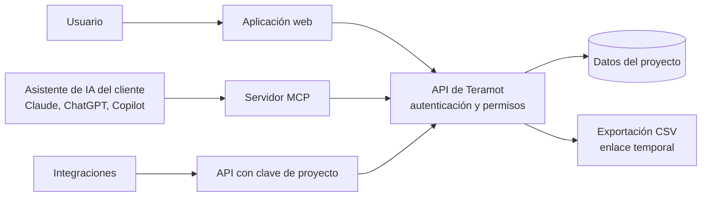

Los datos de Teramot se pueden consumir por cuatro vías. Todas pasan por la misma API, así que en todas rigen **los mismos permisos**.

## Aplicación web

La aplicación web incluye:

- **Asistente conversacional**: preguntas en lenguaje natural sobre los datos del proyecto.
- **Fuentes**: alta, configuración, estado y actualización de conexiones.
- **Explorador de datos**: tablas crudas, procesadas y de resultados, con esquema, vista previa, hallazgos de calidad y linaje.
- **Editor SQL**: consultas de solo lectura sobre las tablas del proyecto.
- **Tablas de resultados**: creación, edición y actualización.
- **Dashboards**: visualizaciones construidas sobre tablas de resultados. Se sanitizan en el servidor y se muestran aislados en el navegador.
- **Conocimiento del proyecto**: definiciones de negocio que usan los agentes.
- **Programación**: frecuencia de actualización de cada proyecto.
- **Administración**: miembros, roles, data shares, registro de actividad y uso de IA.

Una conversación se puede compartir con otros miembros del workspace. Un dashboard se comparte con un enlace que exige iniciar sesión y tener acceso al proyecto.

## Asistentes de IA vía MCP

Teramot publica un servidor **[Model Context Protocol](https://modelcontextprotocol.io)** para que el cliente use sus datos desde el asistente de IA que ya tiene.

| | |
|---|---|
| **Endpoint** | `https://mcp.teramot.com/mcp` |
| **Transporte** | Streamable HTTP |
| **Autenticación** | OAuth 2.1 con PKCE, o una clave personal para clientes que no soportan OAuth |
| **Clientes compatibles** | Claude (web, escritorio, Team, Enterprise y Claude Code), ChatGPT, GitHub Copilot en VS Code, Gemini, Cursor y otros clientes MCP |

### Cómo funciona la identidad

1. El administrador de la herramienta de IA del cliente agrega el conector de Teramot.
2. Cuando una persona lo usa por primera vez, el asistente la redirige a iniciar sesión en Teramot.
3. Desde ese momento, **cada acción se ejecuta como esa persona**, con su rol en cada workspace y proyecto.

Que el conector esté disponible para toda la organización no le da acceso a nadie: solo pueden usarlo las personas que tienen un usuario en Teramot, y cada una ve solo lo que su rol le permite.

Las redirecciones de OAuth se aceptan solo hacia una lista cerrada de destinos: los dominios de los clientes compatibles y direcciones locales para aplicaciones de escritorio.

### Qué se puede hacer vía MCP

| Capacidad | Rol mínimo |
|---|---|
| Listar workspaces y proyectos; leer el conocimiento del proyecto | Solo lectura |
| Explorar tablas, ver esquemas, linaje y hallazgos; consultar con SQL; descargar tablas de resultados | Solo lectura |
| Ver dashboards | Solo lectura |
| Crear, editar y duplicar tablas de resultados y dashboards; editar el conocimiento del proyecto | Miembro |
| Lanzar actualizaciones; corregir transformaciones; gestionar controles; eliminar dashboards | Administrador |
| Eliminar proyectos y workspaces | Owner |

La referencia completa de herramientas y la guía de conexión por cliente están en la [documentación del servidor MCP](/api/intro/).

## API

Para integraciones sistema a sistema, un usuario puede generar **claves de API de proyecto**. Cada clave:

- Queda asociada a un workspace, un proyecto y un usuario.
- Hereda **en cada uso** los permisos actuales de ese usuario: si el usuario pierde el acceso, la clave también lo pierde.
- Se guarda como hash: Teramot no conserva la clave en claro.

## Exportación

Las tablas de resultados se pueden descargar como **CSV**. La descarga se hace con un enlace temporal:

- **Enlace privado** (por defecto): vence a los pocos minutos y exige iniciar sesión con la misma cuenta que lo generó.
- **Enlace directo**: un enlace firmado que también vence a los pocos minutos.
