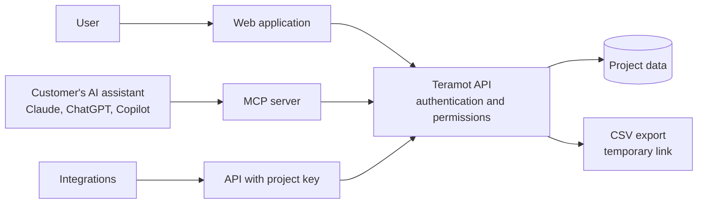

Teramot data can be consumed in four ways. All of them go through the same API, so **the same permissions** apply in every one.

## Web application

The web application includes:

- **Conversational assistant**: natural-language questions about the project's data.
- **Sources**: creation, configuration, status, and refresh of connections.
- **Data explorer**: raw, processed, and results tables, with schema, preview, data-quality findings, and lineage.
- **SQL editor**: read-only queries over the project's tables.
- **Results tables**: creation, editing, and refresh.
- **Dashboards**: visualizations built on top of results tables. They are sanitized on the server and displayed in isolation in the browser.
- **Project knowledge**: business definitions that agents use.
- **Scheduling**: refresh frequency for each project.
- **Administration**: members, roles, data shares, activity log, and AI usage.

A conversation can be shared with other workspace members. A dashboard is shared with a link that only people in the workspace can open, and an admin can limit each dashboard to a minimum role.

## AI assistants via MCP

Teramot publishes a **[Model Context Protocol](https://modelcontextprotocol.io)** server so you can use your data from the AI assistant you already have.

| | |
|---|---|
| **Endpoint** | `https://mcp.teramot.com/mcp` |
| **Transport** | Streamable HTTP |
| **Authentication** | OAuth 2.1 with PKCE, or an access key for clients that do not support OAuth |
| **Supported clients** | Claude (web, desktop, Team, Enterprise, and Claude Code), ChatGPT, GitHub Copilot in VS Code, Gemini, Cursor, v0, Antigravity, and other MCP clients. Setup for each: [Connect an AI assistant](/product/mcp/connect-clients/) |

### How identity works

1. The administrator of your organization's AI tool adds the Teramot connector.
2. When a person uses it for the first time, the assistant redirects them to sign in to Teramot.
3. From then on, **each action runs as that person**, with their role in each workspace and project.

Making the connector available to the whole organization does not give anyone access: only people who have a Teramot user can use it, and each one sees only what their role allows.

OAuth redirects are accepted only to a closed list of destinations: the domains of the supported clients and local addresses for desktop applications.

### What you can do via MCP

An assistant can do exactly what its user's role allows, no more: explore and query tables,
build results tables and dashboards, refresh sources, and so on. The
[Tool reference](/product/mcp/tools-reference/) lists every tool with the minimum role it
needs, and [Roles and permissions](/product/concepts/roles-and-permissions/) what each role
covers.

## API

For system-to-system integrations, a user can generate **project API keys**. Each key:

- Is tied to a workspace, a project, and a user.
- Inherits that user's current permissions **on every use**: if the user loses access, the key loses it too.
- Is stored as a hash: Teramot does not keep the key in plain text.

## Export

Results tables can be downloaded as **CSV** through a temporary link:

- **Private link** (the default, and the one the web application uses): works for 10 minutes and only for the account that requested it.
- **Public link**: an assistant can ask for one when the file has to reach someone without a Teramot account. It works for 15 minutes for anyone who has it.

How to download one: [Results tables](/product/use-the-app/results-tables/#download).
