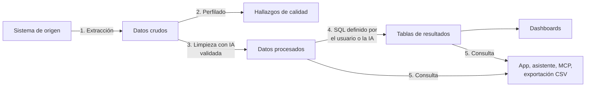
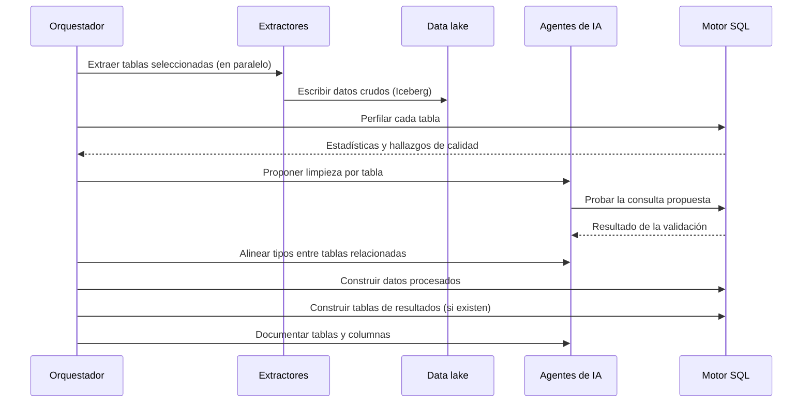

Esta página sigue el recorrido de un dato desde el sistema de origen hasta una respuesta. Hay dos momentos: la **configuración inicial** de una fuente y las **actualizaciones** posteriores.

## Vista de punta a punta

## 1. Conexión

Un administrador del workspace crea una **fuente**. Para eso elige el tipo de sistema, carga las credenciales y el método de conexión (red privada IPsec, túnel SSH o acceso por Internet con lista blanca de IP; ver [Conectividad](/es/architecture/connectivity/)).

Teramot prueba la conexión y **descubre** las tablas y vistas disponibles. El usuario elige cuáles incorporar y cómo actualizarlas.

> [!TIP]
> **Credenciales de solo lectura**
>
> Teramot solo lee de los sistemas de origen y nunca escribe en ellos. Se recomienda crear un usuario de servicio con permisos de lectura limitados a las tablas que se van a incorporar.

## 2. Configuración inicial de una fuente

Al publicar una fuente, el orquestador ejecuta esta secuencia:

1. **Extracción.** Cada tabla se lee y se escribe como tabla cruda. Las tablas se procesan en paralelo, salvo en las APIs con límite de tasa.
2. **Perfilado.** Se calculan estadísticas por columna y se detectan problemas de calidad: valores atípicos, duplicados, mayúsculas inconsistentes, claves candidatas.
3. **Limpieza.** Un agente de IA propone una consulta SQL de limpieza para cada tabla. La consulta se ejecuta y se valida antes de aceptarla (ver [Transformaciones](/es/architecture/transformations/)).
4. **Reconciliación.** Se alinean los tipos de las columnas que sirven para cruzar tablas (por ejemplo, un código de cliente que en una tabla es texto y en otra es número).
5. **Construcción.** Se materializan los datos procesados y después las tablas de resultados que dependen de ellos.
6. **Documentación.** Se generan descripciones de tablas y columnas para el catálogo del proyecto.

## 3. Actualizaciones

Una actualización puede dispararse de varias formas:

- **Programada**, según la frecuencia configurada en el proyecto.
- **Manual**, desde la aplicación: una fuente completa, o solo las tablas que elijas.
- **Por API o MCP**, por ejemplo desde un asistente de IA con los permisos necesarios.

En cada actualización:

1. Se extraen los datos nuevos: la tabla completa o solo los cambios (ver [Actualización e incremental](/es/architecture/refresh/)).
2. Si **cambió el esquema** de una tabla (columnas nuevas, eliminadas o con otro tipo), se vuelve a revisar su limpieza. Si no cambió, se reutiliza la consulta ya validada.
3. Se reconstruyen los datos procesados.
4. Se recalculan las tablas de resultados que dependen de ellos, incluidas las que cruzan varias fuentes.

## 4. Consumo

Con los datos procesados y las tablas de resultados listos, los usuarios pueden:

- Explorarlos y consultarlos con SQL en la aplicación web.
- Preguntar en lenguaje natural al asistente de la aplicación.
- Consultarlos desde su propio asistente de IA vía MCP.
- Verlos en dashboards.
- Exportar tablas de resultados como CSV.

Ver [Formas de consumo](/es/architecture/consumption/).

## Estado y errores visibles para el cliente

Cada proyecto muestra:

- El **historial de actualizaciones**: tipo, estado y tablas afectadas.
- El **estado de cada fuente** y la hora de la última sincronización.
- Los **errores clasificados**, cada uno con un mensaje legible y cómo resolverlo. Las clases están en [Historial de actualizaciones](/es/product/use-the-app/refresh/#historial-de-actualizaciones).

Si una tabla falla varias veces seguidas, deja de reintentarse automáticamente hasta que se revise su configuración. Así se evita que un error persistente consuma recursos en cada ejecución.
