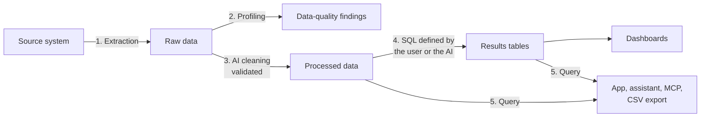
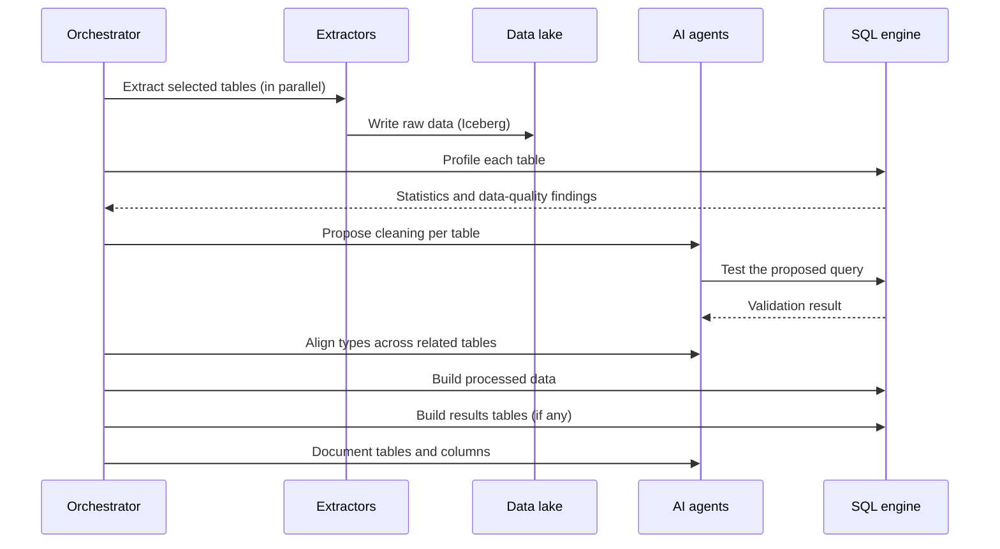

This page follows the path of a piece of data from the source system to an answer. There are two moments: the **initial setup** of a source and the **refreshes** that follow.

## End-to-end view

## 1. Connection

A workspace admin creates a **source**. To do so, they choose the type of system and enter the credentials and the connection method (IPsec private network, SSH tunnel, or Internet access with an IP allowlist; see [Connectivity](/architecture/connectivity/)).

Teramot tests the connection and **discovers** the available tables and views. The user chooses which ones to bring in and how to refresh them.

> [!TIP]
> **Read-only credentials**
>
> Teramot only reads from source systems and never writes to them. We recommend creating a service user with read permissions limited to the tables you plan to bring in.

## 2. Initial setup of a source

When a source is published, the orchestrator runs this sequence:

1. **Extraction.** Each table is read and written as a raw table. Tables are processed in parallel, except for APIs with rate limits.
2. **Profiling.** Per-column statistics are calculated and quality issues are detected: outliers, duplicates, inconsistent capitalization, candidate keys.
3. **Cleaning.** An AI agent proposes a cleaning SQL query for each table. The query is run and validated before it is accepted (see [Transformations](/architecture/transformations/)).
4. **Reconciliation.** The types of the columns used to join tables are aligned (for example, a customer code that is text in one table and a number in another).
5. **Building.** Processed data is materialized, followed by the results tables that depend on it.
6. **Documentation.** Table and column descriptions are generated for the project catalog.

## 3. Refreshes

A refresh can be triggered in several ways:

- **Scheduled**, according to the frequency configured in the project.
- **Manual**, from the application: a whole source, or only the tables you choose.
- **Through the API or MCP**, for example from an AI assistant with the necessary permissions.

In each refresh:

1. New data is extracted: the full table or only the changes (see [Refresh and incremental loading](/architecture/refresh/)).
2. If a table's **schema changed** (new, removed, or retyped columns), its cleaning is reviewed again. If it did not change, the already validated query is reused.
3. Processed data is rebuilt.
4. The results tables that depend on it are recalculated, including those that join multiple sources.

## 4. Consumption

Once the processed data and results tables are ready, users can:

- Explore and query them with SQL in the web application.
- Ask the application's assistant questions in natural language.
- Query them from their own AI assistant via MCP.
- View them in dashboards.
- Export results tables as CSV.

See [Ways to consume data](/architecture/consumption/).

## Status and errors visible to you

Each project shows:

- The **refresh history**: type, status, and affected tables.
- The **status of each source** and the time of the last sync.
- **Classified errors**, each with a readable message and how to fix it. The classes are in [Refresh history](/product/use-the-app/refresh/#refresh-history).

If a table fails several times in a row, it stops being retried automatically until its configuration is reviewed. This prevents a persistent error from consuming resources on every run.
