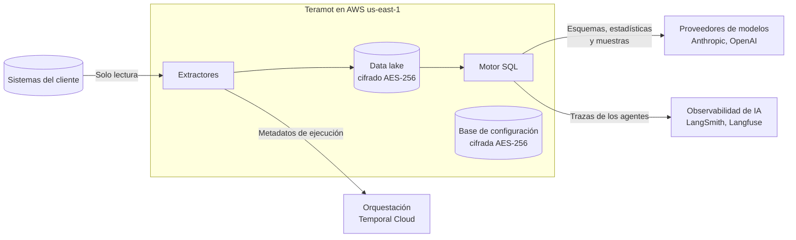

Teramot construye y opera el data warehouse de cada proyecto. Para eso **guarda una copia** de las tablas que el cliente elige incorporar, en infraestructura propia de Teramot en AWS. Esta página reúne en un solo lugar qué información se guarda, qué información sale de esa infraestructura, hacia quién y por cuánto tiempo.

## Resumen

- Las **tablas completas** quedan dentro de la infraestructura de Teramot en AWS.
- A los **proveedores de modelos** solo llegan esquemas, estadísticas y muestras acotadas, nunca tablas completas.
- Nada se usa para **entrenar modelos**.

## Qué guardamos

| Información | Dónde | Retención |
|---|---|---|
| Datos crudos, procesados y tablas de resultados | Data lake en Amazon S3, formato Apache Iceberg | Mientras exista la fuente o el proyecto |
| Versiones anteriores de cada tabla (snapshots) | Data lake en Amazon S3 | 3 días |
| Archivos que sube el usuario | Amazon S3 | Mientras exista la fuente |
| Esquemas de las tablas | AWS Glue Data Catalog, una base por proyecto | Mientras exista la tabla |
| Configuración: workspaces, proyectos, miembros, fuentes, consultas de limpieza y de resultados, dashboards | Amazon Aurora PostgreSQL | Mientras exista el objeto; copias de seguridad por 7 días |
| Credenciales de los sistemas de origen | Amazon Aurora PostgreSQL | Mientras exista la fuente |
| Logs técnicos | Amazon CloudWatch | 365 días |

### Cifrado en reposo

- Los archivos del data lake, los archivos subidos y los resultados de consultas se guardan en Amazon S3 con **cifrado AES-256 del lado del servidor**, activo por defecto en todos los buckets. Ningún bucket tiene acceso público.
- Las bases Amazon Aurora PostgreSQL tienen el **almacenamiento cifrado con AWS KMS**, lo que incluye sus copias de seguridad y snapshots.
- Las credenciales de los sistemas de origen se guardan en esa base cifrada y **la API nunca las devuelve**.
- Las claves de cifrado las administra AWS. Hoy no se ofrecen claves provistas por el cliente (BYOK).

El cifrado en tránsito se describe en [Seguridad y control de acceso](/es/architecture/security/#protección-de-la-plataforma).

## Qué compartimos y con quién

Estos son los servicios externos que reciben información derivada de los datos del cliente durante el procesamiento:

| Destinatario | Para qué | Qué recibe | Retención |
|---|---|---|---|
| **Anthropic** y **OpenAI** | Modelos de lenguaje de los agentes de datos | Esquemas, estadísticas por columna y muestras acotadas de valores (ver el detalle abajo) | Según las condiciones de API del proveedor, que excluyen ese tráfico del entrenamiento |
| **LangSmith** y **Langfuse** | Trazas de los agentes, para depurar y mejorar su calidad | Lo que entra y sale de cada llamada al modelo, incluidas las muestras | 14 días |
| **Temporal Cloud** | Orquestación de las ejecuciones | Metadatos de ejecución: nombres de tablas, esquemas, consultas y estado de cada paso | Durante la ejecución y un período corto posterior |
| **Sentry** | Monitoreo de errores | Información técnica de errores | Período limitado |

La lista completa de proveedores, incluidos los de identidad, facturación y analítica de la aplicación, está en [Proveedores que procesan datos](/es/architecture/security/#proveedores-que-procesan-datos).

### Qué recibe cada agente de datos

| Agente | Qué recibe | ¿Incluye valores reales? |
|---|---|---|
| **Limpieza de datos** | Esquema, estadísticas por columna, claves declaradas y una muestra de hasta 100 filas | Sí, la muestra |
| **Tablas de resultados** | Pedido del usuario, catálogo y esquemas de las tablas, conocimiento del proyecto, los valores más frecuentes de cada columna y las primeras filas de las consultas que prueba | Sí, valores frecuentes y filas de prueba |
| **Reconciliación de tipos** | Esquemas y estadísticas de las columnas que se cruzan | No |
| **Documentación** | Esquemas, descripciones de columnas y consultas de limpieza | No |

Las muestras se envían **sin enmascarar**, porque el agente necesita ver valores reales para limpiar bien. Ver [Cómo limitar lo que se comparte](#cómo-limitar-lo-que-se-comparte).

## Qué no hacemos

- **No entrenamos modelos** propios ni hacemos fine-tuning con datos de clientes.
- **No vendemos ni compartimos** datos de clientes con otros clientes ni con terceros fuera de los listados en esta página.
- **No escribimos** en los sistemas de origen: solo leemos.
- **No replicamos** datos a otras regiones de AWS.
- **No guardamos el historial** del origen: se conserva la versión actual de cada tabla y 3 días de versiones anteriores.

## Cómo limitar lo que se comparte

- **Elegir qué tablas incorporar.** Solo se procesan las tablas que el cliente selecciona al configurar la fuente.
- **Excluir columnas en el origen.** Si una tabla tiene datos personales o sensibles que no hacen falta para el análisis, lo recomendable es exponer una vista sin esas columnas y conectar la vista.
- **Usar un usuario de solo lectura** con permisos limitados a las tablas que se van a incorporar.
- **Borrar lo que ya no se necesita.** Al eliminar una fuente o un proyecto se borran sus tablas y archivos. Ver [Retención y borrado](/es/architecture/retention/).
