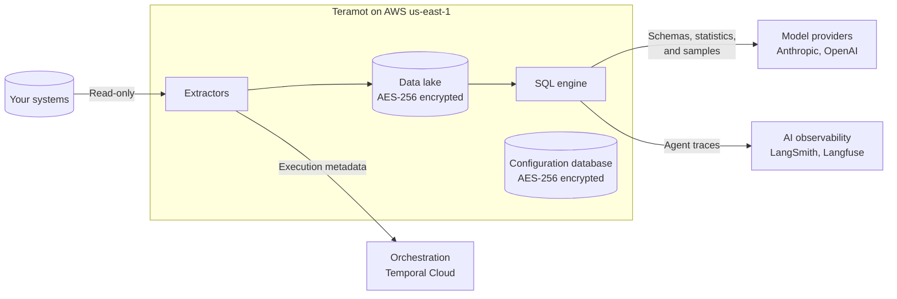

Teramot builds and operates the data warehouse of each project. To do so, it **keeps a copy** of the tables you choose to bring in, on Teramot's own infrastructure in AWS. This page brings together in one place what information is stored, what information leaves that infrastructure, who receives it, and for how long.

## Summary

- **Complete tables** stay within Teramot's infrastructure in AWS.
- **Model providers** receive only schemas, statistics, and bounded samples, never complete tables.
- Nothing is used to **train models**.

## What we store

| Information | Where | Retention |
|---|---|---|
| Raw data, processed data, and results tables | Data lake on Amazon S3, Apache Iceberg format | For as long as the source or project exists |
| Previous versions of each table (snapshots) | Data lake on Amazon S3 | 3 days |
| Files uploaded by users | Amazon S3 | For as long as the source exists |
| Table schemas | AWS Glue Data Catalog, one database per project | For as long as the table exists |
| Configuration: workspaces, projects, members, sources, cleaning and results queries, dashboards | Amazon Aurora PostgreSQL | For as long as the object exists; backups for 7 days |
| Credentials for source systems | Amazon Aurora PostgreSQL | For as long as the source exists |
| Technical logs | Amazon CloudWatch | 365 days |

### Encryption at rest

- Data lake files, uploaded files, and query results are stored in Amazon S3 with **AES-256 server-side encryption**, enabled by default on every bucket. No bucket allows public access.
- The Amazon Aurora PostgreSQL databases have **storage encrypted with AWS KMS**, which also covers their backups and snapshots.
- Credentials for source systems are stored in that encrypted database, and **the API never returns them**.
- Encryption keys are managed by AWS. Customer-provided keys (BYOK) are not currently offered.

Encryption in transit is described in [Security and access control](/architecture/security/#platform-protection).

## What we share and with whom

These are the external services that receive information derived from your data during processing:

| Recipient | Purpose | What it receives | Retention |
|---|---|---|---|
| **Anthropic** and **OpenAI** | Language models for the data agents | Schemas, per-column statistics, and bounded samples of values (see the detail below) | According to the provider's API terms, which exclude that traffic from training |
| **LangSmith** and **Langfuse** | Agent traces, to debug and improve their quality | What goes into and comes out of each model call, including the samples | 14 days |
| **Temporal Cloud** | Run orchestration | Execution metadata: table names, schemas, queries, and the status of each step | During the run and a short period afterwards |
| **Sentry** | Error monitoring | Technical error information | Limited period |

The complete list of providers, including those for identity, billing, and application analytics, is in [Providers that process data](/architecture/security/#providers-that-process-data).

### What each data agent receives

| Agent | What it receives | Includes real values? |
|---|---|---|
| **Data cleaning** | Schema, per-column statistics, declared keys, and a sample of up to 100 rows | Yes, the sample |
| **Results tables** | The user's request, the catalog and schemas of the tables, the project knowledge, the most frequent values of each column, and the first rows of the queries it tests | Yes, frequent values and test rows |
| **Type reconciliation** | Schemas and statistics of the columns used in joins | No |
| **Documentation** | Schemas, column descriptions, and cleaning queries | No |

Samples are sent **unmasked**, because the agent needs to see real values to clean well. See [How to limit what is shared](#how-to-limit-what-is-shared).

## What we do not do

- **We do not train** our own models or fine-tune on customer data.
- **We do not sell or share** customer data with other customers, or with third parties beyond those listed on this page.
- **We do not write** to source systems: we only read.
- **We do not replicate** data to other AWS regions.
- **We do not keep the history** of the source: the current version of each table is kept, plus 3 days of previous versions.

## How to limit what is shared

- **Choose which tables to bring in.** Only the tables you select when configuring the source are processed.
- **Exclude columns at the source.** If a table contains personal or sensitive data that is not needed for the analysis, we recommend exposing a view without those columns and connecting the view.
- **Use a read-only user** with permissions limited to the tables you plan to bring in.
- **Delete what you no longer need.** Deleting a source or a project deletes its tables and files. See [Retention and deletion](/architecture/retention/).
